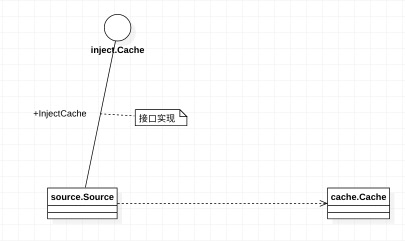

# K8S Operator SDK源码分析
本文记录了自己在阅读分析Operator SDK中的一些比较值得回味的点
## 1. sigs.k8s.io/controller-runtime/pkg/client/runtime/inject.go
列举Cache注入的一个片段如下

```
// Cache is used by the ControllerManager to inject Cache into Sources, EventHandlers, Predicates, and
// Reconciles
type Cache interface {
	InjectCache(cache cache.Cache) error
}

// CacheInto will set informers on i and return the result if it implements Cache.  Returns
//// false if i does not implement Cache.
func CacheInto(c cache.Cache, i interface{}) (bool, error) {
	if s, ok := i.(Cache); ok {
		return true, s.InjectCache(c)
	}
	return false, nil
}
```

这段代码的作用是：将cache.Cache注入参数i interface{}中。但是需要满足前接口与约束条件： 被注入的类型i，必须要实现了inject.go中规定的Cache接口（此接口不同于cache.Cache，而是 InjectCache(cache cache.Cache) error，它指明了i通过什么方法将cache.Cache注入自己）。



inject中还有其它类型的依赖注入（如config等），均可以参照这个逻辑分析。
